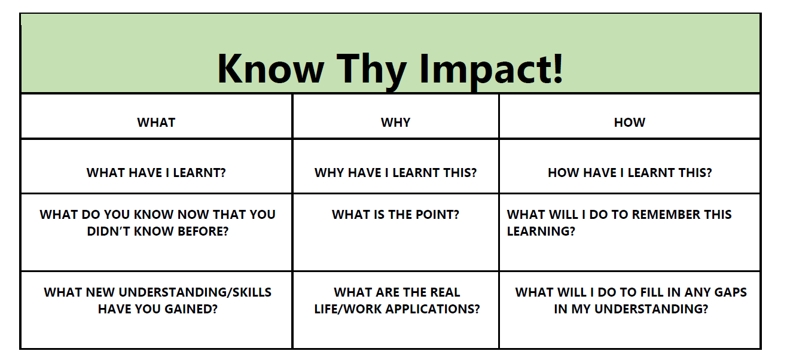
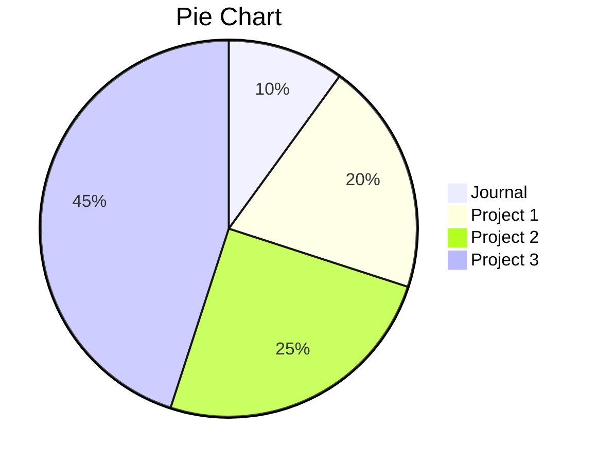

# SDV602-Journal

The document will be update weekly and capture my experience as well as knowledge I learnt.

## Week 1 🥇

### Outline SDV602

The first week gone fast and I started off with the outline of my course. 

The first task of creating a presentation based on the content provided allows me and my teammate look into all aspect of the course oursevles with more details. As we need to present to the whole class so the information needed to be relevant and precise. It also trigger active learning which is students actively research and find the answer instead of just listen from the teacher.

### Journal

As this is my second year so It is normal for us to write journal. The content not only to show our progress but also record our knowledge base and improve our personal writing skills.

While it is make up to 10% of our total course which can be consider small, the journal is also an important part of this course as it is the personal relect and allow me to present my archivement in the future

### Project 

Making up of 90% of the course, the project would be my main focus especial the first and second milestone as it is the foundation of my project and will contribute the to final product.

The final requirements for the project:

- provides live and interactive graphical displays (include chars)

- able to present different graphical views of data sources for a business or scientific analyst

- allow exploreation of data from a data source

- each Data Explorer Screens accpect text input and mouse click and displays brief description of relate to information displayed

- Accpect pointer input 

Some provided examples:

## Week 2 🥈
