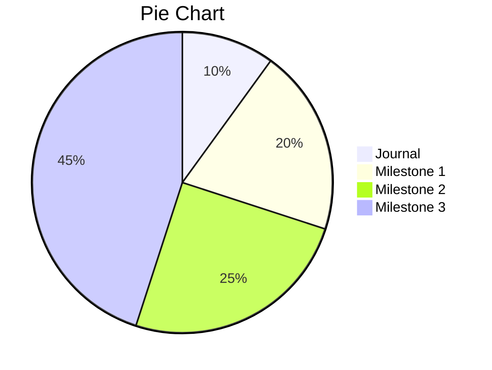

# SDV602-Journal

The document will be update weekly and capture my experience as well as knowledge I learnt.

## Week 1 🥇

### Outline SDV602

The first week gone fast and I started off with the outline of my course. 

The first task of creating a presentation based on the content provided allows me and my teammate look into all aspect of the course oursevles with more details. As we need to present to the whole class so the information needed to be relevant and precise. It also trigger active learning which is students actively research and find the answer instead of just listen from the teacher.

### Journal

As this is my second year so It is normal for us to write journal. The content not only to show our progress but also record our knowledge base and improve our personal writing skills.

While it is make up to 10% of our total course which can be consider small, the journal is also an important part of this course as it is the personal relect and allow me to present my archivement in the future

### Project 

Making up of 90% of the course, the project would be my main focus especial the first and second milestone as it is the foundation of my project and will contribute the to final product.

The final requirements for the project:

- provides live and interactive graphical displays (include chars)

- able to present different graphical views of data sources for a business or scientific analyst

- allow exploreation of data from a data source

- each Data Explorer Screens accpect text input and mouse click and displays brief description of relate to information displayed

- Accepct pointer input 

Some provided examples:

### Python

Python is an easy, general-purpose coding language designed with code readability through its notable use of significant indentation. As one of the high-level programming languages, it’s often used as an introductory language for college students and even universities would adopt the language for computer science courses. According to [Phillip Guo,](https://cacm.acm.org/blogs/blog-cacm/176450-python-is-now-the-most-popular-introductory-teaching-language-at-top-us-universities/fulltext) In July 2014, Python is the most popular language in the top-ranked U.S department with eight of the top 10 CS departments and 27 of the top 39 teach Python in introductory CS0 or CS1 course

#### History

Python is created in 1980s by Guido van Rossum in Netherland as a successor to ABC programming language. He is  the lead developer for the project until 12 July 2018 when he resigned. During that time , he was given the title "Benevolent Dictator For Life" due to his long term commitment as the project's chief.

The first release of Python was in 1991 as Python 0.9 and its other versions, Python2 and 3 was released in 2000 and 2008.

Python 2.0 came with many major features such as cycle detecting garbage collector and support Unicode. The Python 2.7's end-of-life date was initially set at 2015 then changed into 2020 out of concern that a large portion of existing code could not be forward-ported to Python 3.

Python 3.0 came with a major revision of the language that is not completely backward-compatible.

### Setup Python (For Windows)

Installing Python is pretty straight forward

#### Step 1 Download Python

The coding language is free like most other so just need to download from the origininal website. If you need to pay or go to external source to download Python, I don't know what to say.

https://www.python.org/downloads/

While the latest version is the best option, depend on your works, you can also get the Python 2 from the website.

#### Optional

You can also install Python on the Window Store which would help with terminal and path.

#### Step 2 installing pip and fix Path

This step could be extra if you following the install properly but in case pip just giving up on you or your PATH is broken here is some *personal* recommendations.

###  Resource

- Guo, Philip. “Python Is Now the Most Popular Introductory Teaching Language at Top ­U.S. ­Universities.” Accessed July 22, 2021. https://cacm.acm.org/blogs/blog-cacm/176450-python-is-now-the-most-popular-introductory-teaching-language-at-top-us-universities/fulltext.

- “Python (Programming Language).” In *Wikipedia*, July 25, 2021. https://en.wikipedia.org/w/index.php?title=Python_(programming_language)&oldid=1035392450.

## Week 2 🥈

*Under construction*

### Data type

Here is a table of the most popular data type in Python:

| Data type | Mutability | Example and note                                             |
| --------- | ---------- | ------------------------------------------------------------ |
| `bool`    | immutable  | True, False  The "T" and "F" need to be capitalize       |
| `string`  | immutable  | "name"                                                       |
| `dict`    | mutable    | {"key":1.9,3:False}  The key value need to be immutable while the value can be both |
| `int`     | immutable  | 42                                                           |
| `complex` | immutable  | 3 + 2.7j The j is the indicator for complex number      |
| `list`    | mutable    | [4, "string",True]                                           |
| `float`   | immutable  | 1.414                                                        |
| `None`    | immutable  | None similar to null in other language                  |
| `range`   | immutable  | range(1,10) A sequence of numbers using for looping     |
| `set`     | mutable    | {4, 'string',true}set() unorderd, contain no duiplicates |
| `tuple`   | immutable  | (4,'string',True)                                            |
| `bytes`   | immutable  | bytes([119,105,107,105])                                     |

### Exercise - Fizzbuzz

Given the maximum number, if

#### version 1

#### version 2

#### version 3

#### Revision

The excersise helps me visualise the process to build a program from the inital requirements while also poiting out how to improve the resuablity as well as function wise.

### Control flow

### Resource
