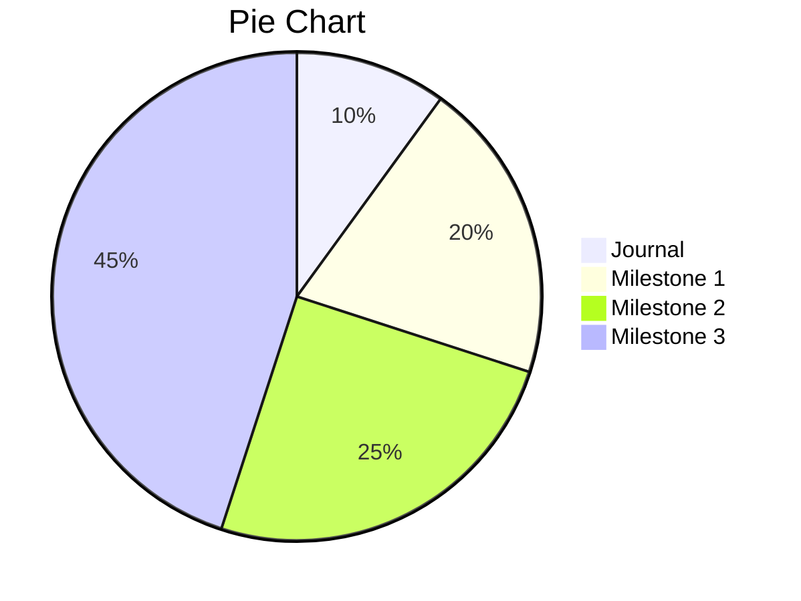
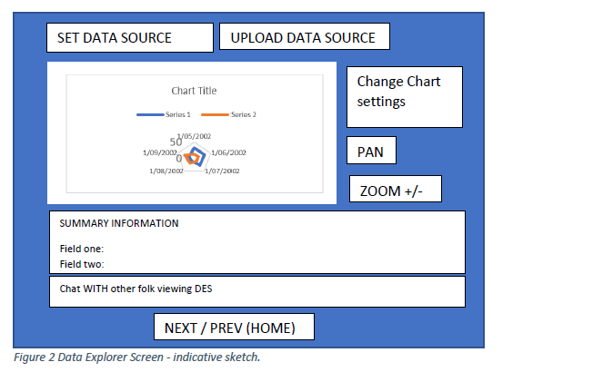
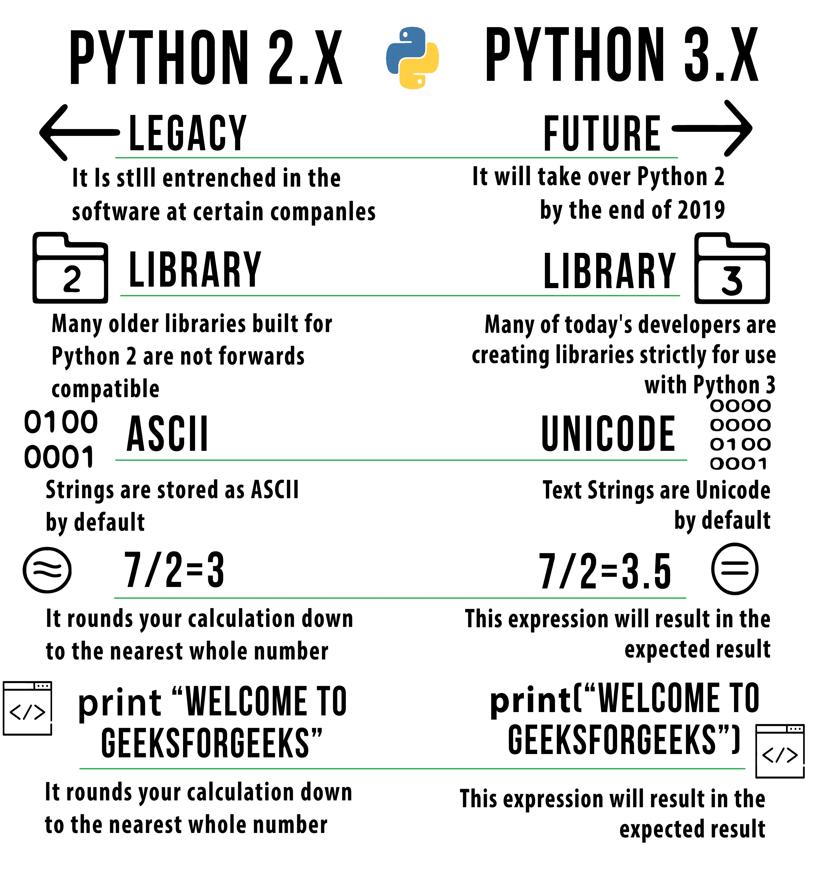

# SDV602-Journal

Student name : Quang Thanh Dao

Student ID : 13508159

The document will be update weekly and capture my experience as well as knowledge I learnt.

## Week 1 🥇

### Outline SDV602

The first week gone fast and I started off with the outline of my course. 

The first task of creating a presentation based on the content provided allows me and my teammate look into all aspect of the course oursevles with more details. As we need to present to the whole class so the information needed to be relevant and precise. It also trigger active learning which is students actively research and find the answer instead of just listen from the teacher.

### Journal


As this is my second year so It is normal for us to write journal. The content not only to show our progress but also record our knowledge base and improve our personal writing skills.

While it is make up to 10% of our total course which can be consider small, the journal is also an important part of this course as it is the personal relect and allow me to present my archivement in the future


### Project

#### Summary

Making up of 90% of the course, the project would be my main focus especial the first and second milestone as it is the foundation of my project and will contribute the to final product.

The final requirements for the project:

- provides live and interactive graphical displays (include chars)

- able to present different graphical views of data sources for a business or scientific analyst

- allow exploreation of data from a data source

- each Data Explorer Screens accpect text input and mouse click and displays brief description of relate to information displayed

- Accepct pointer input 

Some provided examples:




# Project Overview

For SDV602 2021 Project, I would like to use White shark tagging off new Zealand between April 2005 and September 2009 database

https://catalogue.data.govt.nz/dataset/white-shark-tagging-off-new-zealand-between-april-2005-and-september-20091
 The database would be useful to show to location of white shark sighting in New Zealand especially those hotspot where shark would appear frequently as well as tracking individual shark. At the moment the main source of data is from profession institution who actively research for the specie. 

The data base got the latitude and longitude of the sighting which could be presenting on map and divided into region or producing hotspot. 

The time stamp is also available in year like 2004, 2005... which can be useful to compare the changes between year. The data base also included description such as male, female, immature, adult as well as the length which could be added to DES when input new data.

The project could be develop to further tracking shark sighting  and other species of shark around New Zealand.

### Python

Python is an easy, general-purpose coding language designed with code readability through its notable use of significant indentation. As one of the high-level programming languages, it’s often used as an introductory language for college students and even universities would adopt the language for computer science courses. According to [Phillip Guo,](https://cacm.acm.org/blogs/blog-cacm/176450-python-is-now-the-most-popular-introductory-teaching-language-at-top-us-universities/fulltext) In July 2014, Python is the most popular language in the top-ranked U.S department with eight of the top 10 CS departments and 27 of the top 39 teach Python in introductory CS0 or CS1 course

#### History

Python is created in 1980s by Guido van Rossum in Netherland as a successor to ABC programming language. He is  the lead developer for the project until 12 July 2018 when he resigned. During that time , he was given the title "Benevolent Dictator For Life" due to his long term commitment as the project's chief.


Source Google

The first release of Python was in 1991 as Python 0.9 and its other versions, Python2 and 3 was released in 2000 and 2008.

Python 2.0 came with many major features such as cycle detecting garbage collector and support Unicode. The Python 2.7's end-of-life date was initially set at 2015 then changed into 2020 out of concern that a large portion of existing code could not be forward-ported to Python 3.

Python 3.0 came with a major revision of the language that is not completely backward-compatible.



Source google

### Setup Python (For Windows)

Installing Python is pretty straight forward

#### Step 1 Download Python

The coding language is free like most other so just need to download from the origininal website. If you need to pay or go to external source to download Python, I don't know what to say.

https://www.python.org/downloads/

While the latest version is the best option, depend on your works, you can also get the Python 2 from the website.

#### Optional

You can also install Python on the Window Store which would help with terminal and path. This is my screenshot of Python 3.7 on Microsoft store


#### Step 2 installing pip and fix Path

This step could be extra if you following the install properly but in case pip just giving up on you or your PATH is broken here is some *personal* recommendations or fix I found.

##### The best option

The universal way to fix everything in technology world, re-install Python and also remember to tick the option to install PATH for you. From my experience, I tried all the solutions ( some of them work ) below but in the end, I still end up re-install my Python anyway.


<p style="margin: auto; padding: 0;">Source google</p>

##### Add PATH when python cannot be located

- Add path for using Python in Bash

```bash
$ PATH=$PATH:/c/Python39/Scripts
$ PATH=$PATH:/c/Python39 (I store the Python in C:/)
```
* Note this is the temperary solution which suitable for virtual enviroment or one-time use code as the PATH will reset as soon as you terminate the code editor.

##### Install pip the hard way

download get-pip.py over [here](https://pip.pypa.io/en/stable/installation/#get-pip-py)

or here is the script for [get-pip.py](https://bootstrap.pypa.io/get-pip.py)

Then run 

```bash
$ python get-pip.py
```

##### Creating virtual enviroment

- install venv
  
  ```bash
  py -m pip install --user virtualenv
  ```
  
- inital venv
  
  ```bash
  py -m venv env
  ```
  
  env is the location to create virtual enviroment => this will      create in the project and call env

- deactive venv
  ```python
  deactive
  ```

###  Reference

- Guo, Philip. “Python Is Now the Most Popular Introductory Teaching Language at Top ­U.S. ­Universities.” Accessed July 22, 2021. https://cacm.acm.org/blogs/blog-cacm/176450-python-is-now-the-most-popular-introductory-teaching-language-at-top-us-universities/fulltext.

- “Python (Programming Language).” In *Wikipedia*, July 25, 2021. https://en.wikipedia.org/w/index.php?title=Python_(programming_language)&oldid=1035392450.

## Week 2 🥈

### Data type

With some revision from [W3 school](https://www.w3schools.com/python/python_datatypes.asp), here is a table of the most popular data type in Python:

| Data type | Mutability | Example and note                                             |
| --------- | ---------- | ------------------------------------------------------------ |
| `bool`    | immutable  | True, False <br/>The "T" and "F" need to be capitalize       |
| `string`  | immutable  | "name"                                                       |
| `dict`    | mutable    | {"key":1.9,3:False} <br/>The key value need to be immutable data type while the value can be both |
| `int`     | immutable  | 42                                                           |
| `complex` | immutable  | 3 + 2.7j<br />The j is the indicator for complex number      |
| `list`    | mutable    | [4, "string",True]                                           |
| `float`   | immutable  | 1.414                                                        |
| `None`    | immutable  | None<br />similar to null in other language                  |
| `range`   | immutable  | range(1,10)<br />A sequence of numbers using for looping     |
| `set`     | mutable    | {4, 'string',true}set()<br />unorderd, contain no duiplicates |
| `tuple`   | immutable  | (4,'string',True)                                            |
| `bytes`   | immutable  | bytes([119,105,107,105])                                     |

### Boolean Operations

| Operation | Notes                                                        | In JavaScript |
| --------- | ------------------------------------------------------------ | ------------- |
| `x and y` | The code will evaluates the `y` only if `x` is true. Some example<br /> `true and true == true ` <br /> `false and false ==false` <br /> `true and false ==false` | x && y        |
| `x or y`  | Opposite with `and` , `y` will be evaluated only if `x` is fail <br /> `true or true ==true` <br /> `false or true == true` <br /> `false or false == false` | x \|\| y      |
| `not x`   | while also Boolean, `not` has a lower priority than non-Boolean operators so<br /> `not a==b`, `a==b` would be evaluated first before `not` which can be interpret as <br /> `not (a==b)` | !x            |

Base on [W3 school](https://www.w3schools.com/python/python_operators.asp) 

### Exercise - Fizz buzz

Given the maximum number or in this case `up_to`, for each number from 0 to `up_to` is the number is final number.

#### My solution

```python
def fizz_buzz(fizz=3,buzz=5,up_to=15):
    x = 0;
    result =[]
    while x in range(up_to+1):
      string = ""
      if x%fizz==0 and x != 0:
        string += "Fizz"
      if x%buzz==0 and x !=0:
        string += "Buzz"
      result.append((x,(str(x) if string == "" else string)))
      x+=1
    for i in result:
      print(f'{i[0]} , {i[1]}')
  
fizz_buzz(3, 5, 45)
```

### Exercise - print sum , multiply result of table in csv

After recieved the data from csv file and convert into table, We need to calculate the sum of the column and the multiply value of the row

### My unfinished solution

```python
"""
Scans a csv file redirected into the script
 "--header" indicates the first row is a header row
"""
import sys as sys #standard system library
import argparse # parse the auto-generated

def scan(has_header=False): # False is the default value
    result = []     #store the result
    values = []
    do_header = has_header
    header_names = {}
    try: #standard practice to try and catch for data type
        for aline in sys.stdin: #get one line at a time
                this_line = aline.strip().split(',') # putting item seperated by comma in a list
                if do_header:
                    header_names = this_line
                    do_header = False
                else:
                    a_dict = {}
                    for i in range(0,len(this_line)): #loop through each line
                        if has_header :
                            a_dict[header_names[i]]= this_line[i]
                        else:
                            a_dict[i]= this_line[i]

                    result += [a_dict] #add row to result
                    values += [this_line]
    except:
        print("Unexpected error:", sys.exc_info()[0])
        return result,values

    return result,values

# Exercise one
def sum_of( a_list_of_dictionary,column_names=2):
    """
    Return one value that is the sum of the column 
    column_name of each "row" (dictionary)
    """
    # Get a header line
    result = 0
    for a_dictionary in a_list_of_dictionary:
        for key,value in a_dictionary.items():
            if key == column_names:
                result += int(value)
    print(f'Sum value of column {column_names} is {result}')
    

#Exercise Two
def multiple_cols(a_list_of_dictionary,column_names=1):
    """
    Return a new list of "rows" (dictionary)
    That multiples the values of the named columns
    """
    result = 1
    a_dictionary = a_list_of_dictionary[column_names]
    for key,value in a_dictionary.items():
        if key != 0 and value != 0:
            result*=int(value)
    print(f'Muliple value of row {column_names+1} is {result}')

#Exercise Three
# - fix display_table so that the columns all line up
def display_table(a_list_of_dictionary):
    lines = ""
    # Get a header line
    a_dictionary = a_list_of_dictionary[0]
    header_line = ""
    
    for key in a_dictionary:
        header_line += f'{key}\t'
    header_line = header_line.strip()

    # Make up the table
    lines += header_line 

    for a_dictionary in a_list_of_dictionary:
        a_line = ''
        for key,value in a_dictionary.items():
            a_line += f'{value}\t'
        a_line = a_line.strip()
        lines += f'\n{a_line}'
    print(lines)

if __name__ == "__main__": # this code run first
    parser = argparse.ArgumentParser(description="Scan some rows into a list of one list per line.") # build argument parse
    parser.add_argument('--header',action='store_true',help='The first row is a header row.')
    args = vars(parser.parse_args()) # check all the argument
    print(f'The args are {args}')#check all the augent
    #args = sys.argv 
    #print(f'The args are {args}')
    dict_lst,values_lst = scan(args['header']) #scan argument for header to get true and false value
    display_table(dict_lst)
    sum_of(dict_lst,4)
    multiple_cols(dict_lst,0)

```


#### Revision

Although `for` loop would be more common to in the programming language, I was ask to use `while` which not only refresh my memory but also understand the 2 loop functions in JavaScript. In my point of view, their application and structure is very similar with both language especially while loop with range of loop, condition statement as well as end with increment. The same could be apply with `for` loop  but not entirely. While in JavaScript, `for` loop require 3 statement to statement the index, maximum value and increment, Python `for` loop is iterate type which for each elements in list, dictionary or range would lead to one execution and you could control the loop to break or continue after the condition

The exercise Fizz Buzz helps me visualise the process to build a program from the initial requirements while also pointing out how to improve the reusability as well as functionality of the application. Furthermore, when comparing with the tutor final solution, my understanding of functions and how to expand and improve the reusability of the function.

Furthermore, the second exercise allow me to experience first hand the how to manipulate the data from external source which is something will happen all the time in my future career.

### Refrence

- “Python Data Types.” Accessed July 31, 2021. https://www.w3schools.com/python/python_datatypes.asp.

- “Python Operators.” Accessed July 31, 2021. https://www.w3schools.com/python/python_operators.asp.

  

## Week 3 :3rd_place_medal: Python Data structure

Data structure is how data organised, managed and stored in an efficient and simple way. It would allows users or programers to store collection of data, organise and perform operations on them.

According to [Akash](https://www.edureka.co/blog/data-structures-in-python/), python allows user to create their own data structures enabling them to have full control over their functionality. Some user-defined data structures available in python are:

- Stack
- Tree
- Queue
- Graph
- Linked List
- HashMap

### String 

String is immutable which mean string data could not be changed once they have been assigned. In order to change the value of the string, we either can change the value of the string as a whole or the whole string. On another hand, we can use list index and range value to extract from list

Example:

```python
string='0123456'
print(string[0:2]) #'012'
```

### Range

`range(start,end,skip)` is an list of number from the `start` number continue to `end` number in logical order. The order can be decreasing or increasing depend on the `start` and `end` value as well as `skip` value which indicate the space between each value in that range

### Tuple

#### Description

Tuples are the same as lists are the exception that the data once entered into the tuple cannot be changed except for the mutable data in the tuple.

#### Using Tuple

```python
tuple = (1,2,3)+(['hindi','piction'])
print(tuple) #(1,2,3,['hindi','piction'])
tuple[3][1]='Nelson'
print(tuple) #(1,2,3,['hindi','Nelson'])
```

### Set 

#### Description

Set is a collection of unordered elements that are unique. So  changing the data from other collection into set can remove the duplicate data. The operations for set is the same as the arithmetic sets.

There is no same element within a set which would be useful to create a list of unique value

#### Operations

```python
set1 = {1,2,3,4,5}
set2 = {2,3,4,5,6}
set1.union(set2)
set1 | set2
set1.intersection(set2)
set1 & set2
set1.difference(set2)
set1 - set2
set1.symmetric_difference(set2)
set1 ^ set2
```

### List :book:

#### Description

List is mutable

List is used different data types in a sequential manner through the assigned addresses of each element in the list, called Index. The index start from 0 and go on until the last element are called positive index while negative index would start from the last element as -1 until it reaches the 0.

#### Working with List

1. Creating list
   `theList = [1,2,3,4,13,2,1]`

2. Accessing elements
   ```print(theList[2]) # 3```

3. Checking the length of list
   `len(theList) # 7`

4. sorting the value in list

   `sorted(theList) #small to big`

   `theList.sort(reverse=True)# big to small`

### Dictionary :couple:

Dictionary is mutable

Dictionaries are used to store key-value pairs which is similar with object in JavaScript. It is important to note that key needed to be an immutable data type while value can be both immutable or mutable which allow the data to be store in both horizontal and vertical manner. as dictionary and list could be nested in another list or dictionary.

#### Working with dictionary

1. Creating list
   `theList = [1,2,3,4,13,2,1]`

2. Accessing elements
   ```print(theList[2]) # 3```

3. Checking the length of list
   `len(theList) # 7`

4. sorting the value in list

   `sorted(theList) #small to big`

   `theList.sort(reverse=True)# big to small`
   
### Making game 

I go through an exercise which require to created a game without using loop.

### Reference:

- Edureka. “Data Structures in Python | List, Tuple, Dict, Sets, Stack, Queue,” October 10, 2019. https://www.edureka.co/blog/data-structures-in-python/.


## Week 4 :four:

### Python Simple GUI

Today we learn about PySimpleGUI, which helps us create simple application including the layout such as title, font, button and label. Those layout would allow users to interact with python without the need to learn about coding.

One example is by using the backbone of the game from our previous class, using PySimpleGUI I was able to create window to showing the instruction instead of using the console to print the message and instruction.

### Purpose of GUI

With GUI or graphical user interface, user can interact through icon, buttons and message instead of typing command labels, creating and invoking function.

Some Standard UI widget:

- menu
- button
- radio buttons
- text entry and field
- file browser

### Reference

- “Graphical User Interface.” In *Wikipedia*, August 26, 2021. https://en.wikipedia.org/w/index.php?title=Graphical_user_interface&oldid=1040746579.


## Week 5 :five:


## Week 6 :six:

### What I Learnt

#### *args

According to geeksforfeeks.org, the special syntax *args in function used to pass a variable number of arguments to a function 

- the symbol * allow the function to take a variable number of arguments and *args allows function to take in more arguments than the number of formal arguments which is previously defined.
- The syntax allow any number of extra arguments can be tacked on to your current formal parameters even the case of zero arguments.
- Using *, the variable that we associate with the * become iterable so developer can iterate over it or run some higher-order function such as map, filter ,etc.

```python
def myFun(*argv):
    for arg in argv:
        print (arg)
   
myFun('Hello', 'Welcome', 'to', 'GeeksforGeeks')
```

#### **kwargs (key word argument)

The special syntax **kwargs in function definition used to pass a keyworded, variable-length argument list according to geeksforgeeks.org. The name kwargs with the double star allows developer to pass through keyword arguments (and any number of them)

- While also allow users to iterate over the value, there is no order of kwargs when processing the data. This behaviour is identical with dictionary would allow the faster search for larger input as it searches with key word instead of linear search
- the key word argument is the name of the variable as it is pass into the function

```python
def histogram(**kwargs):
    """
    An example of a histogram
    Uses numpy as np to get a list of values in a random range - Gaussian

    Args 
          **kwargs lets you pass arguments into this function

          This includes an example of how to change the plt 'title' by looking for it in **kwargs.
    """
    if kwargs['title']:
           plt.title(kwargs['title'])
    else:
           plt.title("Gaussian Histogram")

    gaussian_numbers = np.random.normal(size=10000)
    
    plt.hist(gaussian_numbers, bins=20)
    if kwargs['value']:
           plt.xlabel(kwargs['value'])
    else:
           plt.xlabel("Value")
    
    plt.ylabel("Frequency")
    #plt.show()
    return plt.gcf()

def show_figFunc(pFigureFunction, **kwargs):
    """
    Shows a figure

    args
        pFigureFunction (a function that returns a matplotlib figure)\n
        **kwargs needs to match kwargs of the function
    """
    current_fig = fig_with_kwargs(pFigureFunction,**kwargs)
    plt.figure(current_fig.number)
    plt.show()

if __name__ == "__main__":
    show_figFunc(histogram, title="Our Name for Title", value = "X label")
```

The code above show with the used of **kwargs, coder can adding more arguments to make the program more specific while also keeping the default value for certain of the function. Furthermore,  due to the dictionary-like behaviour, additional function or data value can be added as long as the function can handle the input from users.

### What I can apply

**kwargs allow input additional argument with come with keyword , I can apply this characteristic to create a general function to support window creation as well as additional details for customisation such as width, height or title while keeping the amount of code to minimum while expand the functionality.

**args on another hand would be useful for processing raw data from csv or other database file which didn't specific the how many data entry is given. Moreover, the syntax can be used to transfer the data list for plotting the data with Matplotlib.

### Reference

- GeeksforGeeks. “*args and **kwargs in Python,” May 30, 2017. https://www.geeksforgeeks.org/args-kwargs-python/.


## Week 6


